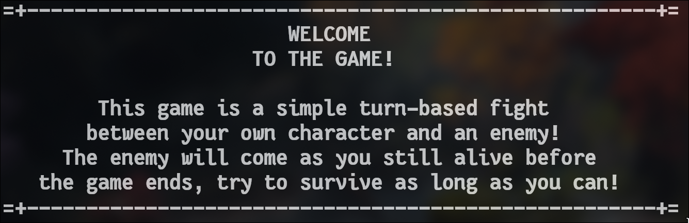

# Turn-Based RPG Game
The game started with a character creation, only the name are needed because the base stats is already added in the [Player class](Mob/Player.java). You can change them in the constructor.

**How to Install?**
1. Copy this repository to a folder somewhere (anywhere, really):
```bash
git clone https://github.com/Quackeyikz/Java_Turn-Based_RPG.git
```

2. Make sure you have Java installed, compile all the java files.
```bash
javac Main.java Mob/*.java Items/*.java
```

3. To run the game, type this:
```bash
java Main
```

## Character Stats
Using the `info()` method to print the player stat.


## Enemy Encounter
The enemy is randomized through `enemyTrigger()` method.


## Loot Drop
Each loop drop chance has 45%, and the last 10% is no drop.


There are some "rare" drops, you'd mostly see common and uncommon stuff because of the drop chance. 


## Ending Screen (Win & Lose)
If you ran out of health, the game will end. But if you decided to stop adventuring, you will ended up winning. This is because the game does not have a clear winning ending, it's a survival game. Now let's see if you're unlucky enough to encounter the final boss.


## Honorable Slime Mention
This poor slime is terrified to the superiority of that is the healing spell.


### But, how to win?
Here's my personal strategy:
1. Take the starter equipments.
2. Find a slime or a high orc, kill them to get better equipment.
3. If you encounter Dragonewts, Rainbow Dragon, and (???), you better use the (3) Flee option. If fails, keep trying or use the (1) Heal option.
4. Keep grinding to get the rare items, that way you will be able to defeat the higher level enemies.
5. Don't forget to stop when you're satisfied.
